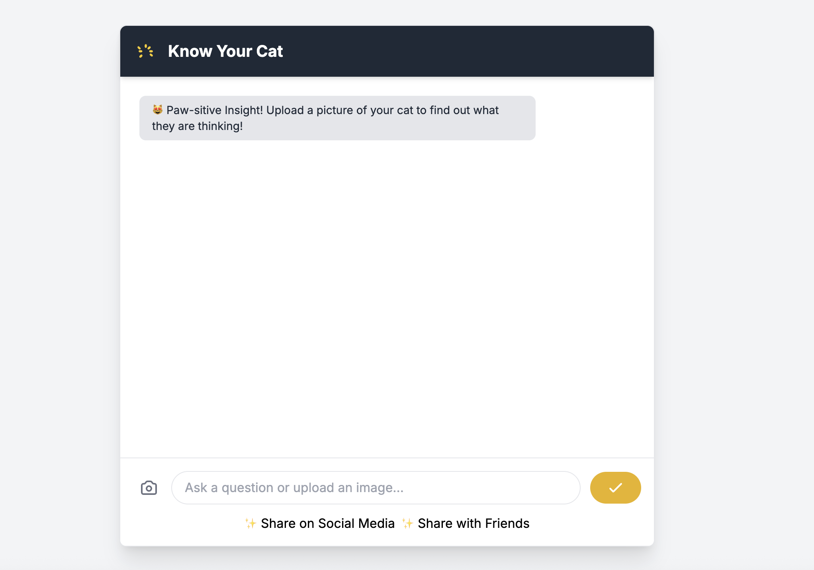

# CatKnows Agent 🐱

> **Sharing pet moments lacks context, so I built a multimodal AI agent to understand our cat's current emotions and instantly write stories.**

## 📖 Project Overview
Pet owners often capture adorable moments but struggle to interpret their cat's subtle body language or come up with engaging captions for social media. **CatKnows Agent** is a multimodal AI application that solves this by acting as a translator between feline expressions and human language.

It uses computer vision to analyze specific visual cues (ears, whiskers, eyes) and Generative AI to craft "Instagram-worthy" stories instantly.

## 📂 Project Structure
```text
CatKnows-Agent/
├── Customer_Browser.html  # Frontend Client (Tailwind + JS)
├── emotion_server.py      # Flask Backend (Orchestrator)
├── emotion_logic.py       # Agent A: Visual Analysis (Gemini 2.5)
├── emotion_sharing.py     # Agent B: Social Content Generation
├── KEY.env                # API Keys (Template for API keys)
└── requirements.txt       # Python Dependencies

## 🏗 Architecture
The project follows a decoupled client-server architecture using a lightweight Flask backend to manage asynchronous AI agents.
Component Breakdown
Frontend (Customer_Browser.html): A responsive web interface built with HTML and Tailwind CSS. It handles image drag-and-drop and sends requests to the backend endpoints (/analyze-emotion).


Backend Server (emotion_server.py): A Flask server that handles HTTP requests.

AI Agents (Google ADK):
Analysis Agent: Uses Gemini 2.5 Flash to analyze visual inputs (pupil size, ear position).
Sharing Agent: Takes the analysis and generates social media captions.

## 🧠 Technical Highlight: Async-Sync Bridge
The application integrates the asynchronous Google Agent Development Kit (ADK) with a synchronous Flask server.
Challenge: Flask runs synchronously by default, but the ADK agents require an asyncio event loop.
Solution: A custom run_async wrapper in emotion_server.py creates and tears down a fresh isolated event loop for each HTTP request, preventing thread blocking and allowing the agents to run concurrently.

## 🤖 AI System Instructions
The agents are prompted with domain-specific knowledge:
Visual Decoder: Instructed to analyze "pupil size, whisker orientation, and ear position" to ensure scientific accuracy rather than just guessing.
Social Writer: Instructed to format output specifically into "Instagram-worthy" captions and "Direct Message" formats.

## 🚀 Key Features
Multimodal Analysis: Uploads images directly to Gemini 2.5 Flash to decode complex visual data.
Scientific "Decoding": Base conclusions on animal knowledge regarding body language.
Social Context Generation: Automatically creates content tailored for specific social contexts.
Interactive UI: Features a "Paw-sitive Insight" chat interface with loading animations.

## 🛠️ Tech Stack
Model: Gemini 2.5 Flash
Framework: Google Agent Development Kit (ADK)
Backend: Python, Flask, Flask-CORS, Asyncio
Frontend: HTML5, JavaScript, Tailwind CSS

⚙️ Setup & Installation
Prerequisites: Python 3.13+, Google Cloud API Key.
1. Clone the Repository
Bash
git clone https://github.com/jennyjingjing525-ai/Cat_Emotion_Agent
cd Cat_Emotion_Agent
2. Install Dependencies
Bash
pip install flask flask-cors python-dotenv google-adk google-genai
3. Configure Environment
Create a new file named `KEY.env` (Must be named exactly `KEY.env`, not `.env`) and paste your actual Google Gemini API key: 
GOOGLE_API_KEY=your_actual_api_key_here
4. Run the Server
Bash
python emotion_server.py
You will see the message: "--- Cat Emotion Server Starting (Decoupled Loops) ---"
5. Launch the Application
Open Customer Browser.html in your web browser. No build step required.

## 📝 Usage Guide
Upload: Click the upload icon or drag a cat photo into the modal.
Analyze: Click "Run Analysis" to get a breakdown of your cat's mood.
Share: Click "✨ Share on Social Media" to generate a caption like:
"Living the purr-fect life! 🐾 Look at those relaxed whiskers..."

## 🔮 Future Improvements
Add support for video analysis of cat movements.
Implement a history database to track mood over time.
Allow users to customize the "tone" (e.g., Sarcastic, Loving).

Built with ❤️ for cats.